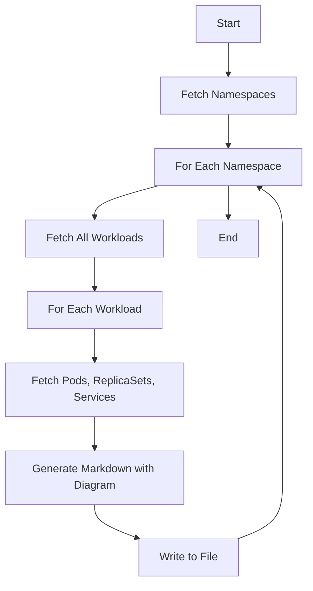
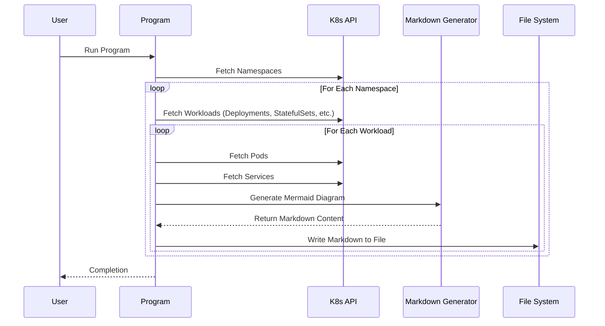
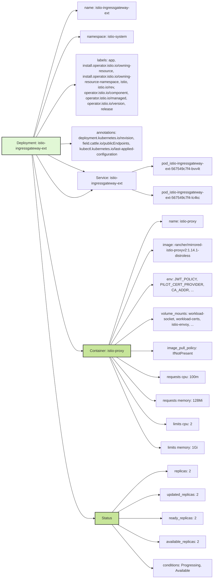

# Kubernetes Info Fetcher

## Introduction

This project fetches details from a Kubernetes cluster and generates markdown files with embedded Mermaid diagrams to visually represent Kubernetes resources. Each markdown file represents an independent workload within a namespace and its associated resources.

## Workflow Diagram



## Sequence Diagram 



## Usage

Ensure you have python installed and the required packages from `requirements.txt`:

```bash
pip install -r requirements.txt
```

Ensure you have access to the Kubernetes cluster and `~/.kube/config` is properly set up.
Run the program:

```bash
python main.py
```

## Example

istio-ingressgateway-ext deployment:





Check the `output_<CLUSTER_NAME>` directory for generated markdown files with diagrams.
